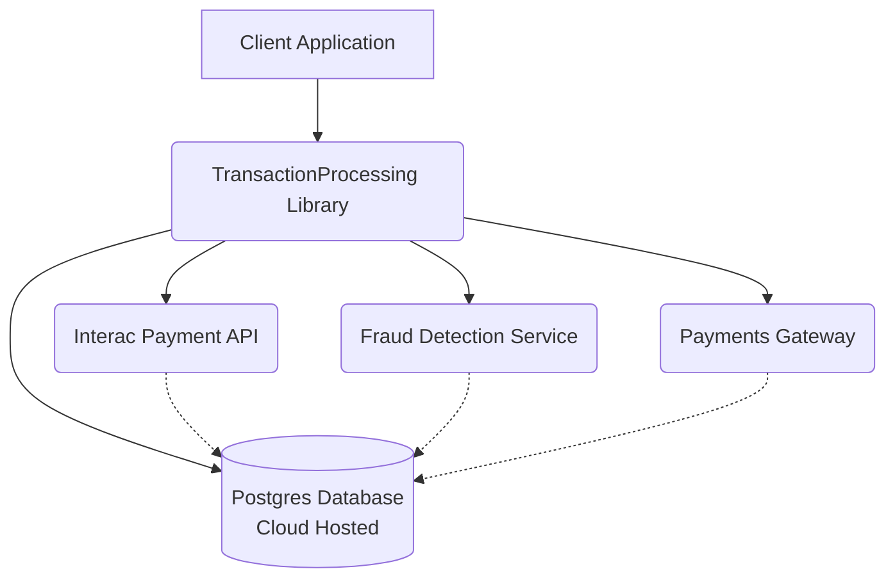

# 🏦 TransactionProcessing Library Documentation

Welcome to the technical documentation for the **TransactionProcessing** library, an internal component at Banque Nationale du Canada (BNC).

<!-- prettier-ignore -->
???+ info "What is this library?"
    The TransactionProcessing library streamlines and standardizes transaction workflows across BNC systems, ensuring reliability, traceability, and compliance.

---

## 📚 Documentation Overview

- [🔍 Debugging & Runbooks](sub-page.md)
- [💻 Code Examples](code/code-sample.md)
- [🧩 Plugin & Extension Points](extensions.md)

---

## 🚀 What is TransactionProcessing?

<!-- prettier-ignore -->
??? note "Key Features"
    - **Consistent transaction lifecycle management**
    - **Built-in retry logic** for transient failures
    - **Comprehensive logging and audit trails**
    - **Extensible hooks** for custom business logic

---

## 🗺️ System Architecture (Mermaid Diagram)

Below is a high-level architecture diagram showing how the TransactionProcessing library interacts with key components:



---

## 🛠️ How to Use

1. **Install the library** (internal package registry):

   ```bash
   npm install @bnc/transaction-processing
   ```

<!-- prettier-ignore -->
??? tip "Need help with installation?"
    Make sure you have access to the internal npm registry. Contact the BNC Platform Engineering team if you encounter issues.

2. **Basic Usage Example:**

   ```typescript
   import { TransactionProcessor } from '@bnc/transaction-processing';

   const processor = new TransactionProcessor();

   processor.process({
     type: 'WIRE_TRANSFER',
     amount: 1000,
     currency: 'CAD',
     onSuccess: (result) => console.log('Success:', result),
     onError: (err) => console.error('Error:', err),
   });
   ```

<!-- prettier-ignore -->
???+ note "How do I get support?"
    You can get support by contacting the BNC Platform Engineering team or by visiting the [Debugging & Runbooks](sub-page.md) section.

---

## 🧑‍💻 When to Use This Library

- When you need **consistent transaction handling** across microservices
- When you want to **reduce duplicated logic** for retries, logging, and error handling
- When you require **auditability** for compliance

---

## 📝 Additional Resources

| Resource                | Description                                      |
|-------------------------|--------------------------------------------------|
| [Runbooks](sub-page.md) | Step-by-step guides for common debugging tasks   |
| [Code Samples](code/code-sample.md) | Ready-to-use code snippets                |
| [Extension Guide](extensions.md) | How to extend or customize the library      |

---

## 

> _For questions or support, contact the BNC Platform Engineering team._

---

For more on TechDocs, see the [Harness IDP TechDocs Overview](https://developer.harness.io/docs/category/techdocs).